# CST8918 Final Project – Terraform, Azure AKS, and GitHub Actions

## Project Overview

This project deploys a containerized Remix Weather Application to Microsoft Azure using Terraform, Azure Kubernetes Service (AKS), Azure Container Registry (ACR), Azure Cache for Redis, Kubernetes, Docker, and GitHub Actions.

The application retrieves current weather information from the OpenWeather API. Redis caches weather responses to reduce repeated API requests. The Azure infrastructure is organized into reusable Terraform modules and separate test and production environments.

The application code and infrastructure code are maintained in the same GitHub repository.

## Team Members

| Team Member | GitHub Profile | Contributions |
| --- | --- | --- |
| Todd O'Neil | [GitHub Profile](https://github.com/Todd-Oneil-CloudDev) | Developed the Terraform infrastructure code and separated the network and remote state into standalone Terraform projects. Created reusable AKS, ACR, and Redis modules for the test and production environments. The test and production Terraform projects use `.tfvars` files to assign variable values at runtime. Configured the GitHub repository, repository secrets, and rulesets. |
| Xinyi Zhao | [GitHub Profile](https://github.com/XinyiZhao-cloud) | Developed the Remix Weather Application and OpenWeather API integration; implemented Redis caching with a ten-minute TTL and an in-memory fallback; created the multi-stage Dockerfile; created the reusable Kubernetes base and test/production Kustomize overlays; wrote the application deployment guide covering local development, Docker, ACR, AKS, Redis, Kubernetes deployment, verification, and troubleshooting; participated in pull-request review and integration. |
| Sara Mirzaei | [GitHub Profile](https://github.com/saraMir26) | Implemented and troubleshot the GitHub Actions CI/CD pipelines: Terraform formatting, validation, tfsec, TFLint, and pull-request planning; protected test and production Terraform plan/apply workflows using Azure OIDC; commit-SHA Docker image validation, ACR publishing, and AKS deployments; Kubernetes rollout, reachability, and failure diagnostics; and final workflow evidence and documentation. |

## Architecture

The project includes the following components:

- A Remix and React weather application
- OpenWeather API integration
- Azure Cache for Redis
- Docker containerization
- Azure Container Registry
- Azure Kubernetes Service
- Azure Virtual Network with environment-specific subnets
- Terraform remote state stored in Azure Blob Storage
- Kubernetes manifests managed with Kustomize
- GitHub Actions for Terraform validation, planning, deployment, and application delivery

### Application Flow

```text
User
  ↓
Azure Load Balancer
  ↓
Remix Weather Application on AKS
  ├── OpenWeather API
  └── Azure Cache for Redis
```

### Infrastructure Organization

```text
Azure Blob Storage Remote State
  ↓
Shared Azure Network
  ├── Test Subnet
  │   └── Test AKS + ACR + Redis
  └── Production Subnet
      └── Production AKS + ACR + Redis
```

## Technologies Used

- Terraform
- Microsoft Azure
- Azure Kubernetes Service
- Azure Container Registry
- Azure Cache for Redis
- Azure Virtual Network
- Azure Blob Storage
- Kubernetes
- Kustomize
- Docker
- Remix
- React
- TypeScript
- Node.js
- GitHub Actions
- OpenWeather API

## Repository Structure

```text
.
├── .github/workflows/          # GitHub Actions workflows
├── app/                        # Remix Weather Application
├── az-credential-params/       # Azure federated credential parameters
├── docs/                       # Deployment documentation and evidence
├── k8s/
│   ├── base/                   # Shared Kubernetes resources
│   ├── test/                   # Test environment overlay
│   └── prod/                   # Production environment overlay
├── terraform/
│   ├── backend/                # Azure Blob Storage remote state
│   ├── network/                # Shared network infrastructure
│   ├── modules/
│   │   ├── acr/                # Azure Container Registry module
│   │   ├── aks/                # Azure Kubernetes Service module
│   │   └── redis/              # Azure Cache for Redis module
│   └── environments/
│       ├── test/               # Test application infrastructure
│       └── prod/               # Production application infrastructure
├── Dockerfile
├── package.json
└── README.md
```

## Remix Weather Application

The application displays current weather conditions for Algonquin College’s Woodroffe Campus.

The OpenWeather request uses the following coordinates:

```text
Latitude: 45.3211
Longitude: -75.7391
```

The OpenWeather API key is supplied through the `WEATHER_API_KEY` environment variable. It is not stored in the repository.

### Redis Caching

Weather responses are cached for ten minutes.

The application first checks Redis for a cached response. If the requested data is not cached, it calls the OpenWeather API and stores the result in Redis.

If Redis is unavailable, the application falls back to an in-memory cache so that a temporary Redis connection failure does not immediately prevent the application from serving weather data.

Azure Redis uses:

```text
TLS port: 6380
TLS enabled: true
Minimum TLS version: 1.2
```

### Application Environment Variables

| Variable | Sensitive | Description |
| --- | --- | --- |
| `WEATHER_API_KEY` | Yes | OpenWeather API key |
| `REDIS_HOST` | No | Azure Redis hostname |
| `REDIS_PORT` | No | Redis TLS port; Azure Redis uses `6380` |
| `REDIS_PASSWORD` | Yes | Azure Redis access key |
| `REDIS_TLS` | No | Set to `true` for Azure Redis |
| `PORT` | No | Application port; defaults to `3000` |
| `NODE_ENV` | No | Application runtime environment |

## Docker

The application uses a multi-stage Docker build.

The Dockerfile:

- Uses Node.js 20 Alpine
- Installs locked dependencies using `npm ci`
- Builds the Remix application in a separate build stage
- Installs production-only dependencies for the final image
- Runs the final container as the non-root `node` user
- Exposes application port `3000`

Build the application image locally from the repository root:

```bash
docker build -t weather-app:local .
```

## Kubernetes

Kubernetes resources are organized using a reusable Kustomize base and separate overlays for test and production.

### Base Configuration

The reusable base contains:

- Application Deployment
- LoadBalancer Service
- ConfigMap
- Example Secret
- Readiness and liveness probes
- CPU and memory requests and limits
- Container security settings

The application container is configured to:

- Run as a non-root user
- Prevent privilege escalation
- Drop Linux capabilities
- Use the default seccomp runtime profile

### Test Overlay

The test overlay:

- Uses the `weather-test` namespace
- Deploys one application replica
- Uses test-specific ACR and Redis configuration

### Production Overlay

The production overlay:

- Uses the `weather-prod` namespace
- Deploys two application replicas
- Uses production-specific ACR and Redis configuration

Real API keys and Redis access keys must not be committed in Kubernetes manifests. A Kubernetes Secret must be created separately for each environment.

## Terraform Infrastructure

Terraform `1.6` or later is required. The project uses the AzureRM provider with the `~> 3.100` version constraint.

### Remote State Backend

Terraform remote state is stored securely in Azure Blob Storage.

The backend Terraform project creates:

- A dedicated resource group
- An Azure Storage Account
- A `tfstate` storage container
- A storage account with a minimum TLS version of 1.2

Separate state keys are used for the network and application environments:

```text
network.tfstate
test.app.tfstate
prod.app.tfstate
```

### Base Network Infrastructure

The shared network Terraform project creates:

- Resource group: `cst8918-final-project-group-01`
- Virtual network address space: `10.0.0.0/14`
- Production subnet: `10.0.0.0/16`
- Test subnet: `10.1.0.0/16`
- Development subnet: `10.2.0.0/16`
- Administration subnet: `10.3.0.0/16`

The network project exports the resource group name, Azure location, virtual network information, and subnet IDs through Terraform remote-state outputs.

### ACR Module

The ACR module creates an Azure Container Registry for application images.

It exports:

- Registry resource ID
- Registry name
- Registry login server

The default ACR SKU is Standard.

### AKS Module

The AKS module creates an Azure Kubernetes Service cluster with:

- Azure CNI networking
- A system-assigned managed identity
- An environment-specific subnet
- Node autoscaling
- `Standard_B2s` worker nodes
- Configurable Kubernetes service CIDR
- Configurable Kubernetes DNS service IP

The module exports:

- AKS resource ID
- AKS cluster name
- AKS FQDN
- Sensitive kubeconfig
- Identity information
- Kubelet object ID

The project specification requires Kubernetes version `1.35` for both test and production clusters.


### Test AKS Environment

The required test AKS configuration is:

```text
Node count: 1
VM size: Standard_B2s
Kubernetes version: 1.32
Subnet: test
```

The test environment also creates:

- A test Azure Container Registry
- A test Azure Cache for Redis instance
- An `AcrPull` role assignment

### Production AKS Environment

The required production AKS configuration is:

```text
Minimum nodes: 1
Maximum nodes: 3
VM size: Standard_B2s
Kubernetes version: 1.32
Subnet: prod
```

The production environment also creates:

- A production Azure Container Registry
- A production Azure Cache for Redis instance
- An `AcrPull` role assignment

### Redis Module

The Redis module creates an Azure Cache for Redis instance with:

- The non-TLS port disabled
- Minimum TLS version 1.2
- Configurable SKU
- Redis hostname output
- TLS port output
- Sensitive primary access key output

### AKS-to-ACR Pull Permission

Each environment grants the `AcrPull` role to the AKS kubelet identity:

```hcl
resource "azurerm_role_assignment" "aks_acr_pull" {
  scope                = module.acr.acr_id
  role_definition_name = "AcrPull"
  principal_id         = module.aks.kubelet_object_id
}
```

This allows the AKS worker nodes to pull the application image from ACR without storing registry credentials in the Kubernetes Deployment.

## Required Terraform Variables

The test and production environments require environment-specific values for:

- ACR name
- ACR SKU
- AKS cluster name
- AKS node pool name
- AKS DNS prefix
- Kubernetes version
- Kubernetes service CIDR
- Kubernetes DNS service IP
- Minimum node count
- Maximum node count
- Redis name
- Redis SKU

Provide these values through an approved Terraform variable file or `TF_VAR_` environment variables.

Do not commit sensitive `.tfvars` files. If a non-sensitive example variable file is added, it should use placeholder values only.

## Prerequisites

Install the following tools before running the project:

- Terraform 1.6 or later
- Azure CLI
- Docker
- Node.js 18 or later
- npm
- `kubectl`
- Access to the team’s Azure subscription
- Access to the GitHub repository
- An OpenWeather API key

GitHub Actions requires these repository secrets:

```text
AZURE_CLIENT_ID
AZURE_TENANT_ID
AZURE_SUBSCRIPTION_ID
```

The Azure identities used by GitHub Actions must have the permissions required for their workflow responsibilities.

## Running the Application Locally

Install the locked dependencies:

```bash
npm ci
```

Run the application checks:

```bash
npm run typecheck
npm run lint
npm run build
```

Set the OpenWeather API key without committing it:

```bash
export WEATHER_API_KEY="replace-with-your-api-key"
```

Start the application:

```bash
npm run dev
```

Open:

```text
http://localhost:3000
```

For complete local Redis, Docker, ACR, AKS, and Kubernetes instructions, see:

```text
docs/application-deployment.md
```

## Infrastructure Deployment Order

Use the following deployment order:

1. Authenticate with Azure.
2. Create the Terraform backend.
3. Initialize and deploy the shared network.
4. Initialize and deploy the test environment.
5. Verify the test AKS, ACR, Redis, and role assignment.
6. Initialize and deploy the production environment.
7. Build and push the Weather Application image to ACR.
8. Create the environment-specific Kubernetes Secret.
9. Deploy the test or production Kubernetes overlay.
10. Verify the application rollout and Redis caching.

Example backend initialization for the network project:

```bash
terraform init && terraform plan --out=env.plan && terraform apply
-backend-config=../backend/backend.hcl env.plan
```

The test and production environment projects must also be initialized using the shared backend configuration.

## GitHub Actions and Automated Tests

Application-level tests are outside the scope of this project. The automated tests focus on Terraform and infrastructure workflows.

### Static Analysis on Push

Every push to any branch runs:

- `terraform fmt -check`
- `terraform validate`
- tfsec

### Pull Request Validation

Pull requests targeting `main` or `test` run:

- TFLint
- A read-only Terraform plan for the shared network

Application-related pull requests also build the Weather Application container
image and tag it with the pull-request commit SHA. The PR identity is read-only,
so image publication is deferred to the protected environment workflows after
merge.

### Infrastructure Deployment

After review and merge, protected workflows run Terraform plan and apply. A
merge to `test` targets the test environment; a merge to `main` targets
production. Both workflows authenticate to Azure through OIDC and apply the
exact saved Terraform plan.

### Docker Image Build and Push

When application code changes in a pull request targeting `main` or `test`,
GitHub Actions:

1. Build the Remix Weather Application.
2. Build the Docker image.
3. Tag the image with the commit SHA.
4. Validate the image without granting the PR identity write access.
5. Push the commit-SHA image to ACR after merge through the protected test or
   production workflow.

This separation keeps pull-request credentials read-only while ensuring only
reviewed commits are published to ACR.

### Test Deployment

After an approved application pull request is merged into `test`, the protected
workflow deploys the application to the test AKS cluster.

The workflow:

- Run only for application changes
- Authenticate using Azure federated identity
- Build and push the commit-SHA image
- Connect to the test AKS cluster
- Deploy the test Kubernetes overlay
- Verify the application rollout


### Production Deployment

After an approved application pull request is merged into `main`, the protected
workflow deploys the application to the production AKS cluster.

The workflow:

- Run only when application code changes
- Authenticate using Azure federated identity
- Use the commit-SHA image
- Connect to the production AKS cluster
- Deploy the production Kubernetes overlay
- Verify the application rollout


## GitHub Collaboration

The repository must meet the following collaboration requirements:

- Professor `rlmckenney` is added as a collaborator
- All team members are added as collaborators
- The `main` branch is protected using a GitHub ruleset
- Direct pushes to `main` are not allowed
- Pull-request review is required
- At least one approving review is required
- Self-approval is not allowed
- Required status checks must pass
- Pull-request branches must be up to date before merging
- Each team member contributes through feature or bug-fix branches
- Each team member creates pull requests targeting `test` or `main`, as appropriate
- Work is divided into small, reviewable pull requests


## Security

The project uses the following security practices:

- GitHub Actions authenticates to Azure using federated identity and OIDC
- Long-lived Azure client secrets are not stored in GitHub
- AKS uses managed identity
- The AKS kubelet identity receives only the required `AcrPull` role
- Redis uses TLS port `6380`
- The Redis non-TLS port is disabled
- Sensitive Terraform outputs are marked as sensitive
- Real Kubernetes Secrets are excluded from Git
- The application container runs as a non-root user
- Container privilege escalation is disabled
- Linux capabilities are dropped
- CPU and memory limits are defined

Never commit:

- OpenWeather API keys
- Redis access keys
- AKS kubeconfig
- Terraform state files
- Sensitive Terraform variable files
- Real Kubernetes Secret manifests
- Azure credentials


## GitHub Actions Workflow Evidence

### Static Terraform Validation

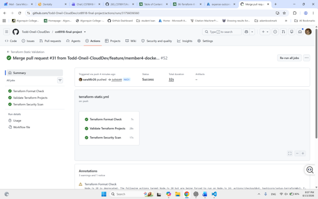

### Pull Request Plan and TFLint

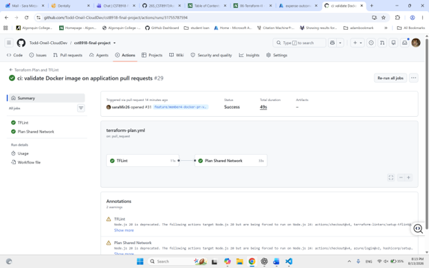

### Docker Pull Request Validation

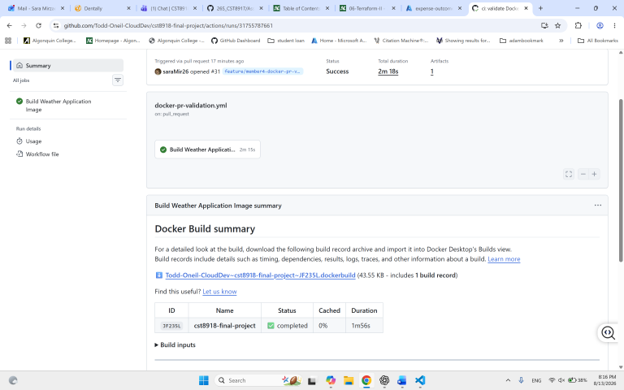

### Test Environment

#### Terraform and Application Deployment

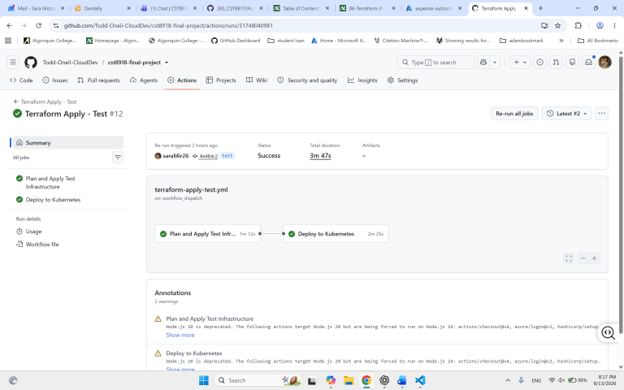

#### Terraform Output

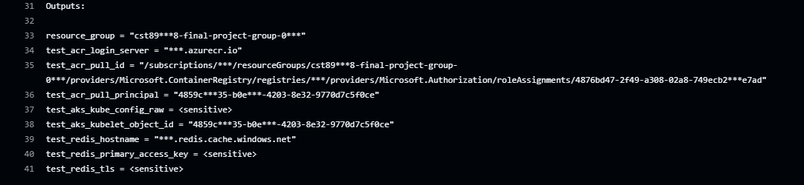

### Production Environment

#### Terraform Deploy

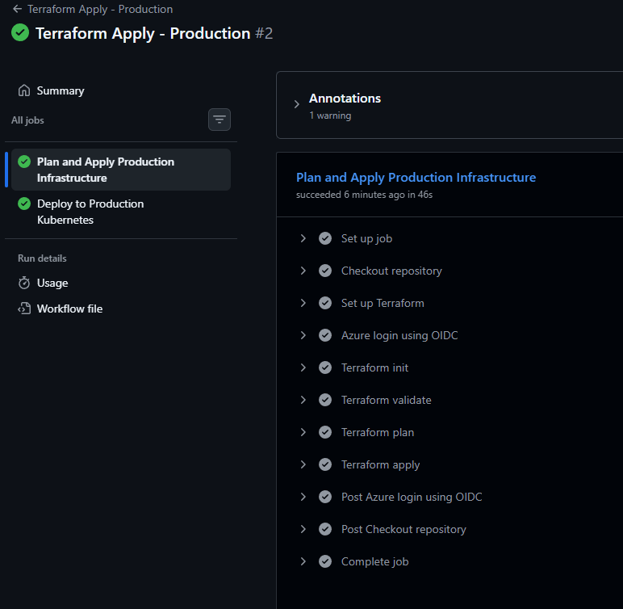

#### Application Deploy

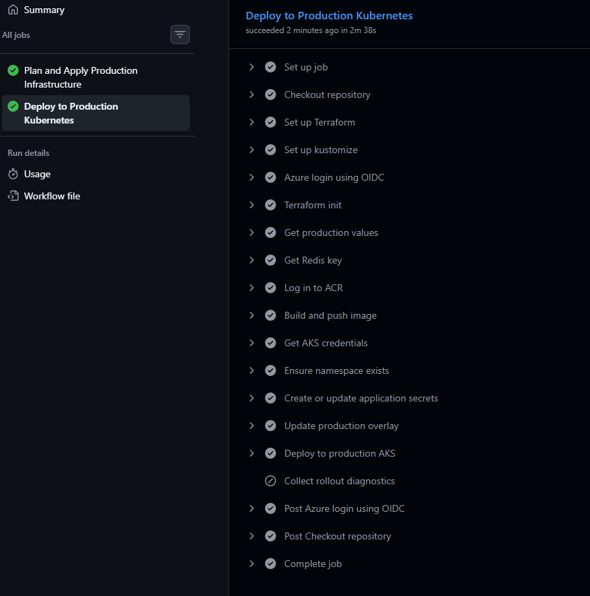

#### Terraform Output

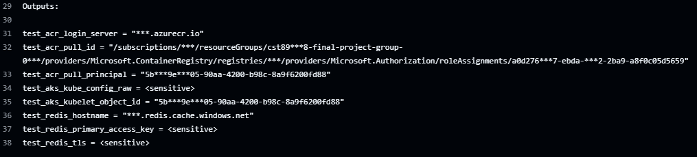

## Weather Application and Redis Evidence

### Local Weather Application

The Remix Weather Application successfully retrieved and displayed current
weather data for Algonquin College's Woodroffe Campus during local testing.


### Production Weather Application

The production application was deployed to AKS and successfully opened in a
web browser through the external IP address assigned to the production Azure
LoadBalancer Service. This screenshot shows the application running in the
production environment rather than on localhost.

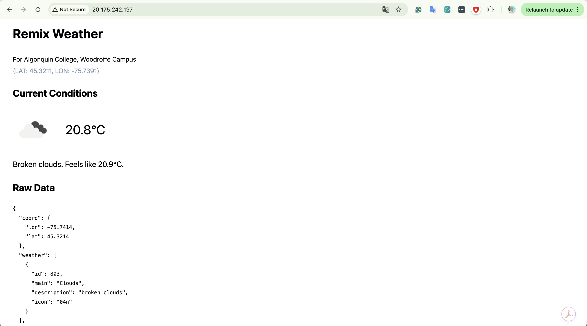

### Production AKS Rollout

The production Deployment reached `2/2` ready and available replicas, the Pods
were running without restarts, and the commit-SHA-tagged image was successfully
rolled out from ACR.

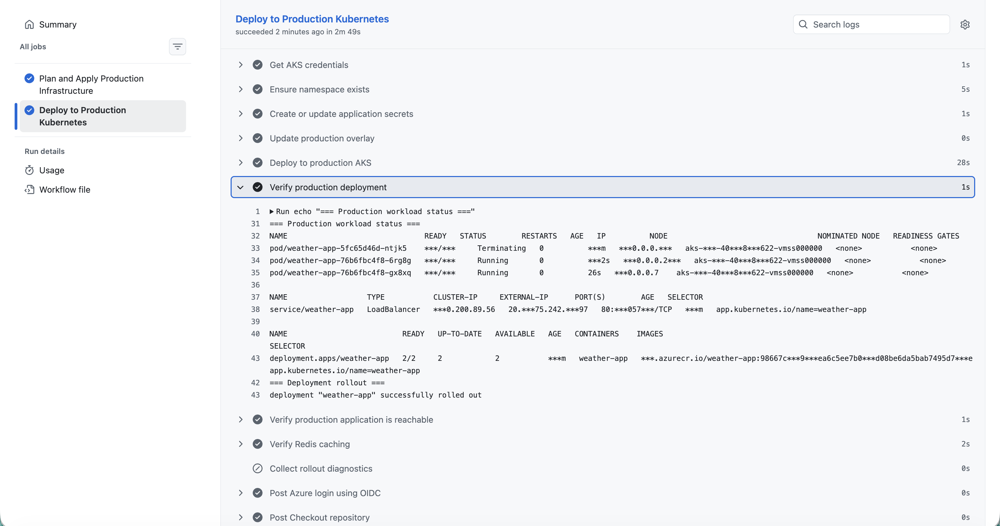

### Production Reachability

The deployment workflow obtained the LoadBalancer address and confirmed that
the production Weather Application returned a successful HTTP response.

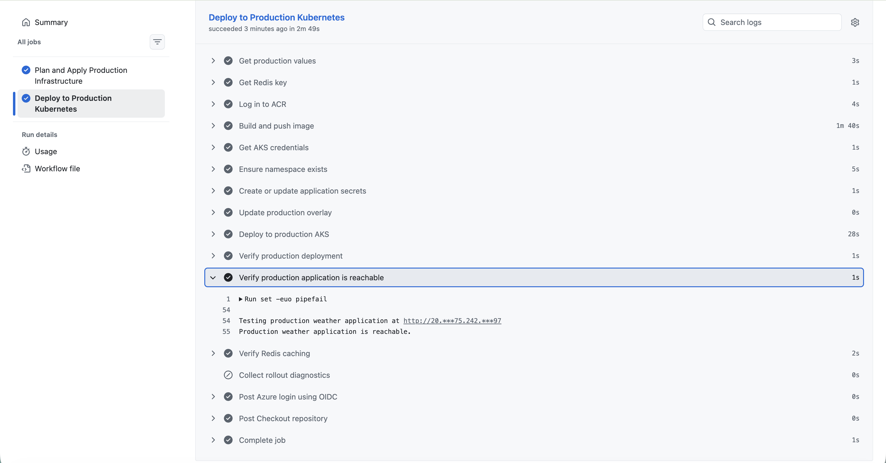

### Redis Cache Verification

The workflow sent repeated requests to the production application and found
`Redis cache hit` entries in the logs of the production Weather Application
Pods, confirming that the shared Azure Cache for Redis was in use.

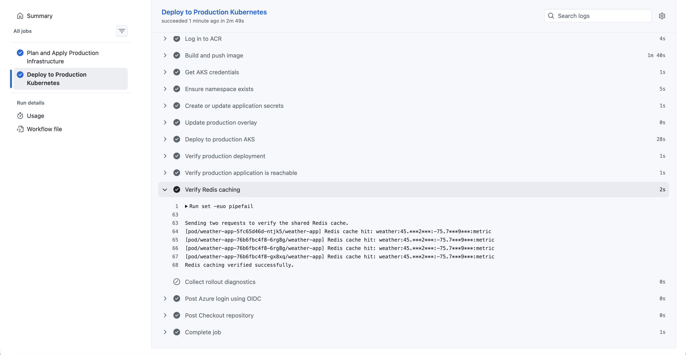